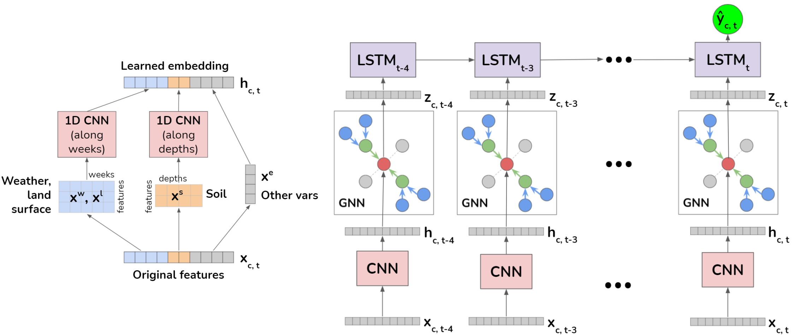

# A GNN-RNN Approach for Harnessing Geospatial and Temporal Information: Application to Crop Yield Prediction

<div align=center></div>

This codebase is the implementation of the [GNN-RNN](https://arxiv.org/pdf/2111.08900.pdf) model (AAAI 2022) for crop yield prediction in the US. GNN-RNN is the first machine learning method that embeds geographical knowledge in crop yield prediction and predicts crop yields at the county level nationwide.

A workshop version of this work won the [Best ML Innovation Paper](https://www.climatechange.ai/events/neurips2021#accepted-works) award at NeurIPS workshop on Tackling Climate Change with Machine Learning, 2021.

## Requirements and installation
- Python 3
- PyTorch 1.0+
- Other packages: dgl, geopandas, numpy, scikit-learn, pandas, matplotlib, tensorboard

Older versions might work as well. As of 2023-04-19, the following commands can be used to download the necessary packages using conda. Geopandas is sometimes tricky to install; see its documentation for more options in case it doesn't work.

`conda create -n gnnrnn`

`conda activate gnnrnn`

`conda install geopandas`

`conda install numpy scipy scikit-learn pandas matplotlib tensorboard`

`conda install pytorch torchvision torchaudio pytorch-cuda=12.4 -c pytorch -c nvidia`

`conda install -c dglteam/label/th24_cu124 dgl`

## Data

Sample crop yield dataset is stored in `data/data_weekly_subset.npz` and the nation-wise adjacency map is stored in `map/`.

Unfortunately, since we are preparing a journal publication, we currently are only able to release a subset of the dataset (Illinois and Iowa), but it should give an idea of the data format.

[This sheet](https://docs.google.com/spreadsheets/d/1hhQ8lGzfgLLyl-gKX13NNboJFywIsJoJOKdttx9hKxE/edit?usp=sharing) contains descriptions of the columns in the dataset. Each row coresponds to one county/year pair.

## Experiment scripts

For all methods, make sure to check the `test_year`, `model`, and `crop_type` parameters. If `train_week` and `validation_week` are set to 52, no masking is performed.

**GNN and GNN-RNN**

From the "gnn" or "gnn-rnn" directory, run `./run_train.sh` to train the respective methods.

To test the model, please update the checkpoint `-cp` in `run_test.sh`, and:
```./run_test.sh```
`--validation_week` determines which week to start masking data from (e.g. if it's 26, all features starting from week 26 is replaced with the historical averages, simulating predicting in the middle of the year)
**Basic regression baselines**

`baseline/simple_run_train.sh` contains basic methods (linear regression, gradient boosting regressor, MLP). It's slow though.

**Single-year baselines**

From the "baselines" directory, run 

`./single_year_run_train.sh cnn`

`./single_year_run_train.sh gru`

`./single_year_run_train.sh lstm`

**CNN-RNN and RNN (5-year model baselines):**

From the "cnn-rnn" directory, run

`./run_train.sh cnn_rnn`

`./run_train.sh rnn`

## Disclaimer

While GNN-RNN is an improvement over other methods like CNN-RNN, training on the current dataset is still unstable (validation/test losses fluctuate dramatically). This may partially be due to these domain-specific issues in our problem setup (which is mostly the same as the CNN-RNN paper (Khaki et al. 2020)):

1. We lack a good feature describing the overall increase in yields over time due to technological improvements. Right now we use the average nationwide yield for the previous year as a feature, but this is a noisy indicator. Simply fitting a linear regression for each county's yields over time may be better, as shown in Figure 3 of [this paper](https://www.nature.com/articles/s41598-020-80820-1) (Shahhosseini et al. 2021).
2. We only validate and test on single years. This leads to noisy model selection; the validation loss is dominated by whether the model adequately reproduces the overall nationwide yield level in the validation year; this may not accurately reflect the performance in a different test year.

We are working on addressing these points. But for now we wanted to make sure you are aware of these issues.

## Paper

If you find our work inspiring, please consider citing the following paper:

```bibtex
@inproceedings{fan2022gnn,
  title={A GNN-RNN approach for harnessing geospatial and temporal information: application to crop yield prediction},
  author={Fan, Joshua and Bai, Junwen and Li, Zhiyun and Ortiz-Bobea, Ariel and Gomes, Carla P},
  booktitle={Proceedings of the AAAI conference on artificial intelligence},
  volume={36},
  number={11},
  pages={11873--11881},
  year={2022}
}
```

## References

[CNN-RNN](https://github.com/saeedkhaki92/CNN-RNN-Yield-Prediction)</br>
[DNN](https://github.com/saeedkhaki92/Yield-Prediction-DNN)</br>
